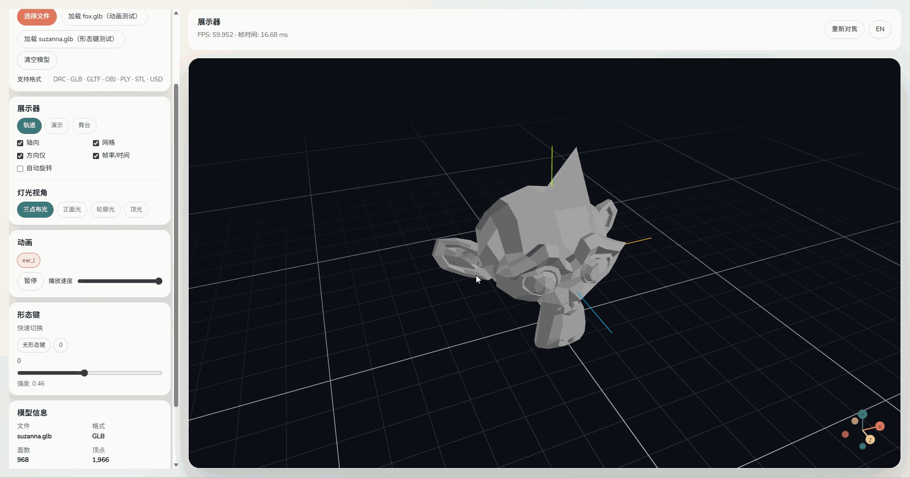

# Simple 3D Viewer

[English](README.md) | [中文](README.zh-CN.md)

离线优先的单文件绿色版 3D 模型查看器，支持拖拽加载、快速检查与验证动画或形态键。

## 截图

## 亮点
- 离线可用（内置示例模型 + Draco 解码器）。
- 拖拽加载。
- 支持格式：DRC、GLB、GLTF、OBJ、PLY、STL、USDZ（USD 需先转为 USDZ）。
- 模型统计：面数、顶点、网格、材质、包围尺寸。
- 灯光预设 + 视图模式（轨道/演示/舞台）。
- 动画播放 + 形态键（shape keys）。
- FPS + 帧时间叠加。
- 自定义属性查看（GLTF/GLB 的 extras），支持复制 JSON。

## 使用
- 点击 **加载 RobotExpressive.glb（动画测试）**。
- 点击 **加载 suzanna.glb（形态键测试）**。
- 或将你的模型拖拽到右侧画布。
- 使用左侧面板或 Leva 快捷开关与灯光设置。

## 开发
前端（在 `frontend/` 目录）：
- `pnpm run dev`
- `pnpm run build`
- `pnpm run preview`

Wails：
- `wails dev`
- `wails build`

## 资源
- `frontend/public/RobotExpressive.glb`（动画测试）
- `frontend/public/suzanna.glb`（形态键测试）
- `frontend/public/draco`（Draco 解码文件）

## 备注
- USD 文件请先转换为 USDZ 再加载。
- 自定义属性仅在 GLTF/GLB 中显示（asset/root/scene/nodes/materials 的 extras）。
