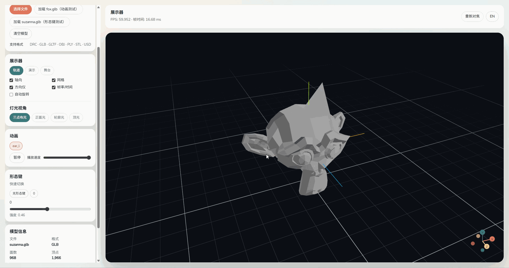

# Simple 3D Viewer

[English](README.md) | [中文](README.zh-CN.md)

离线优先的单文件绿色版 3D 模型查看器。这个工具主要给开发、美术和测试在本地快速验模型用，不走后台，不依赖账号，也不把文件上传到外部服务。

## 截图

## 功能介绍

Simple 3D Viewer 是一个面向开发、美术和测试的本地 3D 模型查看器，核心目标是快速确认模型文件是否能加载、是否显示正常，以及动画、形态键、材质变体和自定义字段是否按预期随文件交付。它不依赖后台服务，不需要账号，也不会把模型上传到外部平台，适合在交付前、联调前或问题复现时做一次轻量检查。

### 本地模型加载

- 支持拖拽加载和文件选择，常用格式包括 `DRC`、`GLB`、`GLTF`、`OBJ`、`PLY`、`STL`、`USD`、`USDZ`。
- `GLTF` 如果依赖外部贴图、`.bin` 或其他资源，需要把相关文件一起拖入或一起选择。
- Draco 解码器随应用放在本地，压缩过的 `GLB/GLTF` 可以离线打开。
- 内置 `RobotExpressive.glb` 和 `suzanna.glb` 两个示例，分别用于验证动画播放和形态键控制。

### Three.js 模型检查

默认渲染引擎是 Three.js，适合日常检查普通模型资产。模型加载后，左侧面板会显示文件名、格式、面数、顶点数、网格数量、材质数量和包围尺寸，用来快速判断模型规模和性能压力。画布顶部会显示 FPS、帧时间和 GPU 渲染时间，方便判断当前模型在本机上的渲染负载。

针对 `GLB/GLTF`，工具会额外解析几个在运行时最容易出问题的内容：

- 动画片段：可以选择动画、播放/暂停，并调整播放速度。
- 形态键：可以快速切换形态，也可以按滑杆精确调整每个形态键强度。
- `KHR_materials_variants`：可以在默认材质和不同材质变体之间切换，检查变体配置是否生效。
- `extras` 自定义属性：按 asset、root、scene、nodes、materials 分组展示，并支持复制 JSON。

### 查看与排查工具

Three.js 视图提供轨道、演示、舞台三种模式，支持轴向、网格、方向仪、性能统计和自动旋转开关。灯光预设包含无光照、三点布光、正面光、轮廓光和顶光，方便暴露模型结构、法线、材质和尺寸问题。需要重新查看完整模型时，可以一键重新对焦；需要切换文件时，可以清空当前模型后继续拖入新文件。

### Cesium 卫星预览

除了 Three.js，应用还保留 Cesium 渲染入口，主要用于地球和卫星场景预览。切换到 Cesium 后，可以使用固定位置或 TLE 轨道根数放置模型，调整时间倍率，聚焦或跟踪卫星，显示轨道线，并可设置卫星姿态垂直于地面。这个模式更适合验证卫星模型在地球坐标和轨道场景中的展示效果。

### 适用边界

Simple 3D Viewer 的定位是“快速打开、快速检查、快速定位问题”，不是建模软件、材质编辑器或资产管理系统。复杂编辑、批量资产治理和最终渲染仍应交给专业 DCC、引擎或资产平台完成；这里更适合作为模型进入后续流程前的第一道本地检查工具。

## 使用
- 点击 **加载 RobotExpressive.glb（动画测试）**。
- 点击 **加载 suzanna.glb（形态键测试）**。
- 或将你的模型拖拽到右侧画布。
- 使用左侧面板或 Leva 快捷开关与灯光设置。

## 开发
前端（在 `frontend/` 目录）：
- `pnpm run dev`
- `pnpm run build`
- `pnpm run preview`

Wails：
- `wails dev`
- `wails build`

## 资源
- `frontend/public/RobotExpressive.glb`（动画测试）
- `frontend/public/suzanna.glb`（形态键测试）
- `frontend/public/draco`（Draco 解码文件）

## 备注
- `USD/USDZ` 通过 Three.js 的 USDZ 加载能力处理，复杂 USD 资产建议先打包或转换为 USDZ 再加载。
- 默认渲染引擎为 Three.js；Cesium 仍可用于卫星/地球预览。
- 自定义属性仅在 GLTF/GLB 中显示（asset/root/scene/nodes/materials 的 extras）。
